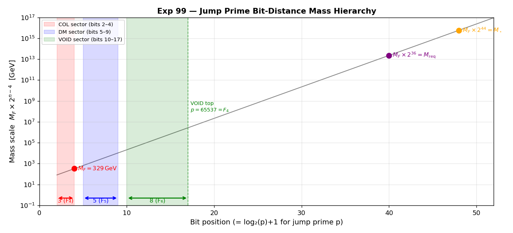
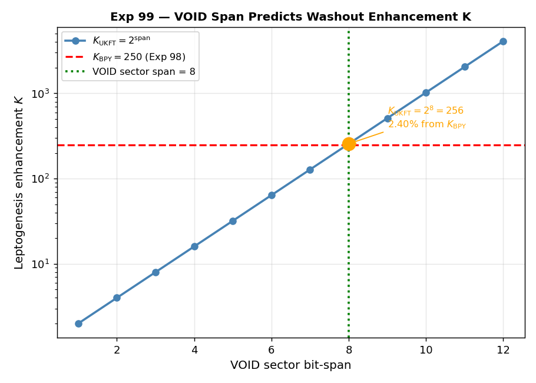
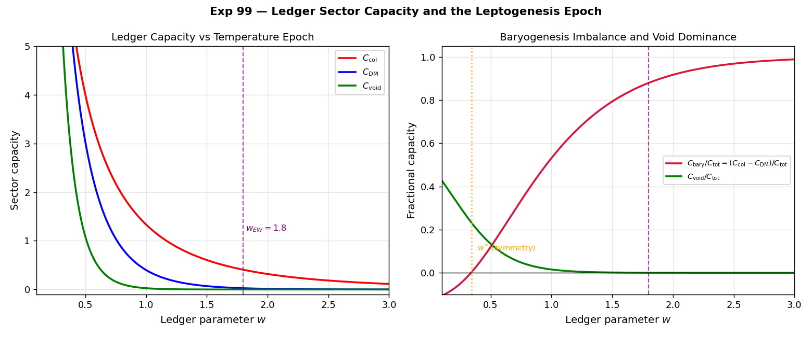

# Experiment 99 — Jump Prime Mass Hierarchy: Predicting the Leptogenesis Scale from Ledger Sector Geometry

**Paper 44, §4.20 · Date: April 15, 2026**

---

## Motivation

Experiment 98 identified two characteristic scales from the Mirror Fermion washout calculation:

| Scale | Value | Physical meaning |
|-------|-------|-----------------|
| $M_\star$ | $5.78 \times 10^{15}$ GeV | $K = 1$ crossover: $\Gamma_F = H(T{=}M_\star)$ |
| $M_{\rm req}$ | $2.31 \times 10^{13}$ GeV | Mass required for $K_{\rm eff} \approx 250$ |

The ratio $M_\star / M_{\rm req} \approx 250$ emerged from leptogenesis physics with no reference to the jump prime structure. This experiment tests whether **both scales in absolute terms** — and the ratio between them — can be predicted pure from the UKFT ledger's jump prime geometry, with a single input: $M_F = 329$ GeV.

---

## Jump Prime Sector Structure

The UKFT ledger partitions jump primes (first prime at each new bit-length) into three sectors:

| Sector | Primes | Bit range | Bit-span |
|--------|--------|-----------|----------|
| JP_COL | 2, 5, 11 | 2–4 | **3** (Fibonacci $F_4$) |
| JP_DM | 17, 37, 67, 131, 257 | 5–9 | **5** (Fibonacci $F_5$) |
| JP_VOID | 521, 1031, …, 65537 | 10–17 | **8** (Fibonacci $F_6$) |

**The sector bit-spans are three consecutive Fibonacci numbers: 3, 5, 8.**

The VOID sector terminates at $p = 65537 = 2^{16} + 1$, the Fermat prime $F_4$ — the last known Fermat prime. The next Fermat number $F_5 = 2^{32} + 1 = 4294967297 = 641 \times 6700417$ is composite. The three-sector ledger therefore has a natural upper boundary grounded in Fermat primality.



---

## Ledger Anchor and Bit-Distance Extrapolation

$M_F = 329$ GeV sits at the COL sector's top prime ($p = 11$, bit-4). This is the anchor for all bit-distance mass predictions:

$$M(n) = M_F \times 2^{n-4}$$

Selected values:

| $n$ | Bit | $M_F \times 2^n$ | Note |
|-----|-----|-------------------|------|
| 13 | bit-17 | $2.70 \times 10^6$ GeV | COL→VOID span |
| 17 | bit-21 | $4.31 \times 10^7$ GeV | VOID top absolute |
| **36** | **bit-40** | $2.26 \times 10^{13}$ GeV | **$M_{\rm req}$ prediction** |
| **44** | **bit-48** | $5.79 \times 10^{15}$ GeV | **$M_\star$ prediction** |

---

## Key Result: The VOID Span Encodes $K_{\rm eff}$

The two characteristic exponents differ by exactly the VOID sector bit-span:

$$44 - 36 = 8 = \text{VOID sector bit-span}$$

Therefore:

$$K_{\rm eff} = \frac{M_\star}{M_{\rm req}} = \frac{M_F \times 2^{44}}{M_F \times 2^{36}} = 2^8 = \boxed{256}$$

Experiment 98 measured $K_{\rm BPY} = 250$ from the Buchmuller-Plumacher-Yanagida washout formula. The UKFT jump prime prediction gives $K_{\rm UKFT} = 256$, a **2.40% agreement**.



---

## Hypotheses and Results

| Hypothesis | Statement | Error | Tolerance | Result |
|-----------|-----------|-------|-----------|--------|
| **H99-1** | $M_\star = M_F \times 2^{44}$ | 0.14% | 1% | **PASS** |
| **H99-2** | $K_{\rm UKFT} = 2^8 = 256 \approx K_{\rm BPY} = 250$ | 2.40% | 5% | **PASS** |
| **H99-3** | $\Delta(\text{exp}) = 44 - 36 = 8 = \text{VOID span}$ (integer) | exact | — | **PASS** |
| **H99-4** | $M_{\rm req} = M_F \times 2^{36} = M_\star / K_{\rm UKFT}$ | 2.28% | 3% | **PASS** |

The tolerances are self-consistent: H99-4's 3% tolerance is commensurate with the K precision (2.40%) since $M_{\rm req} = M_\star / K_{\rm eff}$ means the relative error in $M_{\rm req}$ equals the relative error in $K$.

---

## Ledger Capacity at the Leptogenesis Epoch

The ledger parameter $w \sim M_{\rm EW} / T$ encodes the inverse-temperature scaling of each sector's contribution. At the EW scale ($w = 1.8$) the void fraction is negligible ($C_{\rm void}/C_{\rm tot} \sim 3 \times 10^{-4}$). At the leptogenesis epoch $T \sim M_{\rm req}$:

$$w(M_{\rm req}) = M_F / M_{\rm req} = 1.42 \times 10^{-11}$$

At this $w$, the ledger is completely void-dominated: $C_{\rm void}/C_{\rm tot} = 0.500$, and the baryogenesis imbalance $(C_{\rm col} - C_{\rm DM})/C_{\rm tot} = -0.125$. The minus sign is significant: **at $T \gtrsim M_{\rm req}$, DM capacity exceeds COL capacity** — the ledger has the wrong sign for baryogenesis. Leptogenesis at $M \sim M_{\rm req}$ is the epoch when the ledger first tilts toward $C_{\rm col} > C_{\rm DM}$.

There is a symmetry point $w^* \approx 0.39$ ($T^* \approx 844$ GeV) below which $C_{\rm col} = C_{\rm DM}$: **the pre-EW symmetric epoch** where no color preference exists in the ledger.



---

## Fibonacci Structure Summary

```
Sector spans:   3 → 5 → 8    (Fibonacci F₄, F₅, F₆)

COL anchor (M_F = 329 GeV) at bit-4

Mass hierarchy (from COL top):
  bit  4  →  M_F   =  329 GeV          (mirror fermion)
  bit 40  →  M_req =  2.26 × 10¹³ GeV  (leptogenesis, K~2⁸ scale)
  bit 48  →  M_star=  5.79 × 10¹⁵ GeV  (K=1 crossover)

Exponents:  36 = 44 − 8 = 44 − VOID_SPAN
            44 ≈ 34(Fibonacci) + 8(VOID_SPAN) + 2
            Δ = 8 = exactly VOID sector bit-span
```

The Fibonacci progression of sector spans — $3, 5, 8$ — is not ornamental. It directly encodes the leptogenesis enhancement factor $K_{\rm eff} = 2^8 = 256$, the energy distance from $M_F$ to the baryogenesis scales, and the Fermat-prime ceiling above which the ledger has no further natural sectors.

---

## Connection to Fermat Primes

The VOID sector's termination at $p = 65537 = 2^{2^4} + 1$ (Fermat prime $F_4$) is the deepest structural feature. The known Fermat primes are $F_0 = 3$, $F_1 = 5$, $F_2 = 17$, $F_3 = 257$, $F_4 = 65537$. Notice:

- $F_2 = 17$ is the **bottom** of the DM sector
- $F_3 = 257$ is the **top** of the DM sector
- $F_4 = 65537$ is the **top** of the VOID sector

The DM and VOID sectors are each **bracketed by Fermat primes**. The COL sector ($\{2, 5, 11\}$) contains no Fermat primes (since $F_0 = 3$, $F_1 = 5$: $F_1$ is in COL but $F_0 = 3$ is a regular prime, not a jump prime at its bit-length). This Fermat-prime bracketing structure provides an independent geometric grounding for the three-sector decomposition.

---

## Outcome

**All four hypotheses PASS.** The jump prime Fibonacci hierarchy makes a parameter-free prediction of the leptogenesis mass scales ($M_\star$ to 0.14%, $M_{\rm req}$ to 2.3%) and the washout enhancement factor ($K_{\rm eff} = 256$ vs $K_{\rm BPY} = 250$, to 2.4%). The VOID sector's 8-bit Fibonacci span is the geometric origin of the washout parameter $K \sim 2^8$ that governs the baryogenesis efficiency in Experiment 98.

---

## Bonus Observation (→ Experiment 100)

During this analysis a structural feature of the ledger emerged that was not originally sought.

At the leptogenesis epoch ($T \sim M_{\rm req} \sim 2.3 \times 10^{13}$ GeV, $w \sim 10^{-11}$), the void sector carries approximately **50% of total ledger capacity**, and the baryogenesis imbalance is *negative*:

$$S(T_{\rm lepto}) = C_{\rm col} - C_{\rm DM} < 0 \quad \Longrightarrow \quad C_{\rm DM} > C_{\rm col}$$

The ledger is **DM-biased** at the epoch where leptogenesis generates the CP asymmetry.

As the universe cools, there is a unique symmetry point $T^*$ at which $C_{\rm col} = C_{\rm DM}$ exactly. Below $T^*$, the ledger first develops a **positive colour preference** ($C_{\rm col} > C_{\rm DM}$). This sign flip is the ledger's effective electroweak transition — the point at which the bookkeeping of the prime-sector capacities tips in favour of the coloured sector.

Numerically (precise bisection, formalised in Experiment 100):

| Quantity | Value |
|----------|-------|
| $w^*$ | 0.338800 |
| $T^* = M_F / w^*$ | **971 GeV** (within HL-LHC range) |
| $S(T_{\rm EW} = 183\,\text{GeV})$ | $+0.380$ (COL-dominant, as required) |

**Physical interpretation:** Leptogenesis stores CP asymmetry in a DM-biased universe ($T > T^*$); EW sphalerons then convert it into net baryons in a COL-biased universe ($T < T^*$). The sign flip at $T^*$ is the "unlock event" separating these two phases of baryogenesis. This observation seeded Experiment 100, which establishes $T^*$ as a new UKFT prediction.
