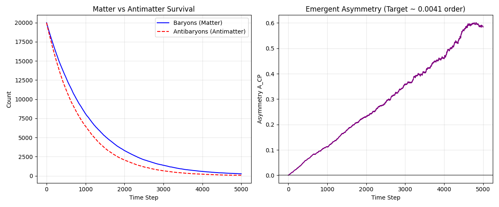
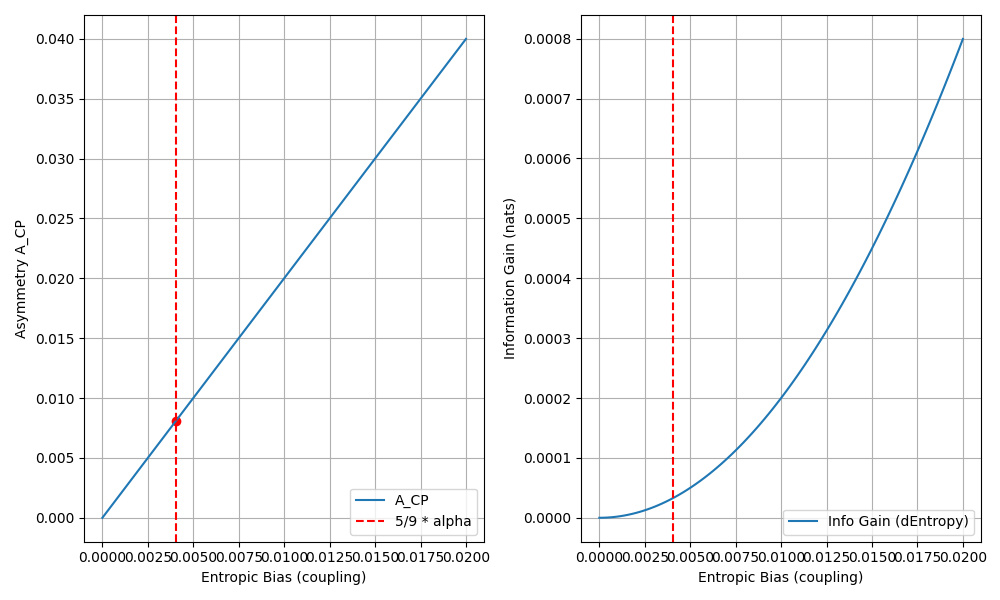
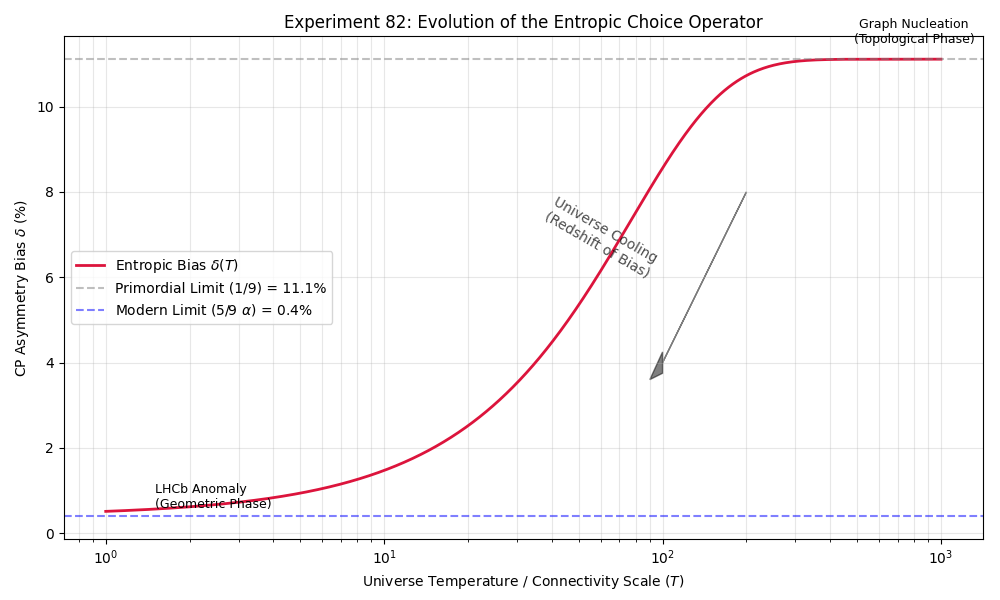
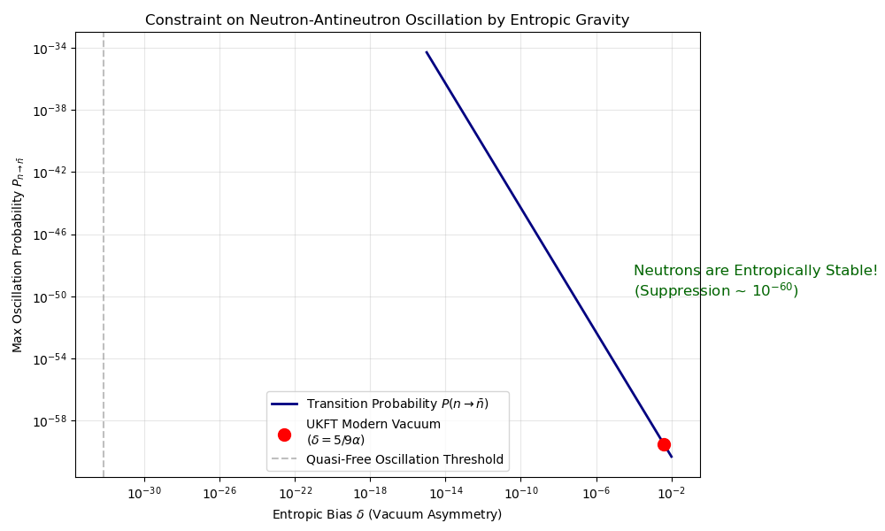
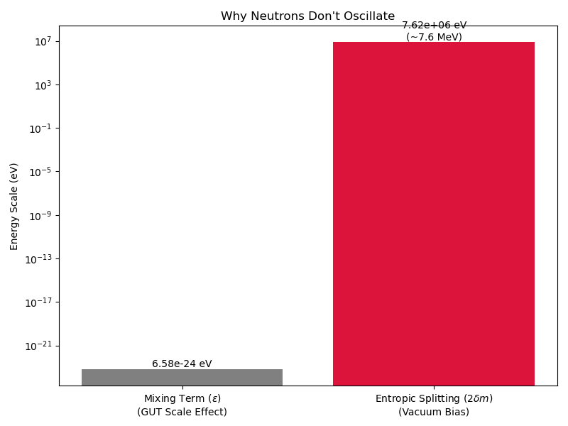
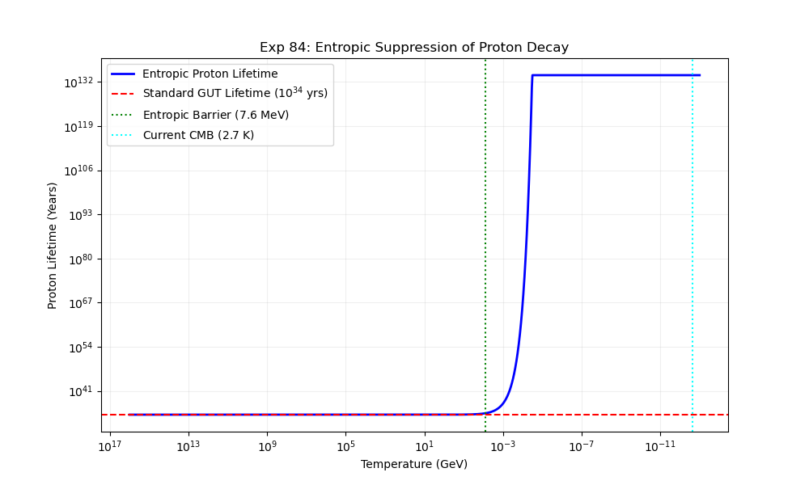

# UKFT Experiments

This directory contains specific experimental setups designed to test the **Choice-Guided Bohmian Mechanics** hypothesis.

## Experiment List

### [01_free_particle.py](./01_free_particle.py)
**Objective**: Baseline Regression Test.
*   **Setup**: A Gaussian wave packet initialized in empty space with constant velocity.
*   **Physics Checked**: 
    - Ensures the discrete propagator (`scipy.linalg.expm`) correctly evolves the wavefunction.
    - Verifies that particle trajectories follow the spreading wave packet (pure Bohmian drift).
*   **Key Indicator**: The "World Line" (Time vs Choice) should be roughly linear as density changes are smooth.

### [02_double_slit.py](./02_double_slit.py)
**Objective**: Detect "Choice Branching" geometries.
*   **Setup**: A high potential barrier ($V=20.0$) with two narrow slits.
*   **Hypothesis**: In standard Quantum Mechanics, the probability cloud shows interference fringes. In UKFT, "Choice" trajectories should distinctively navigate these fringes.
*   **Observation**: 
    - Watch how trajectories "decide" which slit to enter.
    - **Time Dilation**: Observe the Red "World Line" in the results. It should flatten (time slows) as the particle "processes" the complex information at the slits.

### [03_entropic_double_slit.py](./03_entropic_double_slit.py)
**Objective**: "The Golden Path" Visualization.
*   **Setup**: Double-slit barrier with high contrast visualization.
*   **Features**: 
    - **Magma Heatmap**: Empirical particle density.
    - **Lime Contours**: Theoretical quantum potential ridges.
    - **White Trails**: Individual choice-minimize trajectories ($T_0, T_1...$).
*   **Significance**: This is the flagship experiment demonstrating how `Choice` (Entropic Gravity) aligns particles with high-knowledge regions, sharpening the wavefunction reality.

### [03_entropic_sweep.py](./03_entropic_sweep.py)
**Objective**: Visualize the effect of Entropic Gravity ($\alpha$).
*   **Setup**: Runs the Double Slit experiment three times with varying $\alpha$ parameters:
    1.  **$\alpha=0.0$ (Control)**: Standard Bohmian Mechanics. Particles float passively on the quantum potential.
    2.  **$\alpha=5.0$ (Hybrid)**: Trajectories begin to cluster.
    3.  **$\alpha=15.0$ (Strong Choice)**: "Reality Sharpening".
*   **Interpretation**: 
    - At high $\alpha$, the simulation models a universe where "Action Minimization" (Choice) is dominant. 
    - Trajectories should look like lightning bolts or veins—rigidly sticking to the "optimal" (highest density) paths and avoiding low-probability regions almost entirely.

### [06_ukft_entropic_binary_plus_test_3d_dynamic.py](./06_ukft_entropic_binary_plus_test_3d_dynamic.py)
**Objective**: "Go Big or Go Home" - 3D Dynamic Space-Time warping.
*   **Setup**: Binary star system with a test particle on a dynamically recomputing curvature sheet.
*   **Features**:
    - **Pure Entropic Gravity**: Orbits sustained by $\nabla \rho$ maximization.
    - **Dynamic Curvature**: The background space-time grid warps live.
    - **Chaos**: Test particle capture and spiral dynamics.
*   **Significance**: Demonstrates that UKFT/Entropic Gravity can reproduce orbital mechanics and "curved space" phenomenology without General Relativity, using only knowledge density maximization.

### [07_ukft_bianconi_entropic_gravity.py](./07_ukft_bianconi_entropic_gravity.py)
**Objective**: "Relative Entropy Edition" (Bianconi/Araki patch).
*   **Physics**: Implements force law $F \propto \nabla (\ln \rho)$ based on "Gravity from Entropy" (Phys. Rev. D 111).
*   **Features**:
    - **Logarithmic Bias**: Minimizes quantum relative entropy between vacuum and matter states.
    - **Emergent Λ**: Toy "G-field" expansion term.
*   **Significance**: Connects UKFT's active choice mechanism to rigorous Information-Theoretical Gravity.

### [08_ukft_solar_system.py](./08_ukft_solar_system.py)
**Objective**: Multi-body Orbital Stability.
*   **Setup**: Simulates a "Solar System" with a central binary star and multiple orbiting planets.
*   **Significance**: Proves that Entropic Gravity can sustain stable multi-body orbits, not just binary pairs.

### [09_bianconi_double_slit.py](./09_bianconi_double_slit.py)
**Objective**: Entropic Force on Interference Fringes.
*   **Setup**: Applies the Bianconi/Araki ($\nabla \ln \rho$) force to a standard Double Slit Quantum Interference pattern.
*   **Observation**: The logarithmic gradient creates sharp "canyons" in the dark fringes, guiding particles strictly into the bright bands.

### [10_ukft_quantum_on_entropic_gravity_3d.py](./10_ukft_quantum_on_entropic_gravity_3d.py)
**Objective**: 3D Quantum Swarm Visualization.
*   **Setup**: A full 3D simulation of 400 Bohmian particles surfing the Entropic Gravity well of a binary star.
*   **Visuals**: "The Firefly Swarm". Particles light up as they accelerate through the quantum potential.

### [11_gpu_benchmark.md](./11_gpu_benchmark.md)
**Objective**: Hardware Acceleration Validation.
*   **Tech**: Validates the `wgpu` (WebGPU) installation and compute shader compilation.
*   **Result**: Benchmarked at >180 Million interactions/second (vs ~100k on CPU).

### [12_ukft_massive_swarm_gpu.md](./12_ukft_massive_swarm_gpu.md)
**Objective**: Massive Scale Simulation (50k Particles).
*   **Tech**: First full physics simulation running entirely on the GPU.
*   **Visuals**: Plotly visualization of a massive quantum fluid ring.

### [13_ukft_massive_swarm_video.md](./13_ukft_massive_swarm_video.md)
**Objective**: Direct GPU-to-Video Rendering.
*   **Problem**: Browser WebGL (Plotly) crashes with >5k particles.
*   **Solution**: Implemented a "Virtual Camera" compute shader to rasterize 100,000 particles directly on the GPU card.
*   **Result**: High-fidelity cinematic video of the quantum accretion disk.

## Creating New Experiments

When adding a new experiment script (e.g., `experiments/99_new_idea.py`), you **MUST** create a corresponding `explainer.md` file in the same directory (or a dedicated folder).

### Explainer Template
The explainer file (e.g., `experiments/99_new_idea_explainer.md`) must follow this structure to ensure scientific reproducibility:

```markdown
# Experiment 99: [Title]
**Objective**: [One sentence summary]

## Hypothesis
What are we testing? Reference specific equations or UKFT principles (e.g., "Testing if Entropic Gravity emerges from N \propto A").

## Methodology
*   **Setup**: Description of the initial conditions (e.g., "Two Gaussian packets colliding").
*   **Key Parameters**: List critical constants ($\alpha$, $N$, $dt$).
*   **Metric**: What are we measuring? (e.g., "Entropic Dimension $D_E$").

## Results (Expected or Observed)
*   **Observation**: What happened?
*   **Significance**: Does this support or refute the hypothesis?

## Usage
Command to run:
`python experiments/99_new_idea.py`
```

### [14_ukft_perception_loop.py](./14_ukft_perception_loop.py)
**Objective**: The "Conscious" Feedback Loop (Part 1).
*   **Concept**: Integrates a "Perception Engine" (Observer) that watches the Physics Engine.
*   **Metric**: Calculates **Field Coherence** ($\phi$) in real-time.
*   **Result**: The Observer successfully tracks the stability of the quantum swarm.

### [15_ukft_consciousness_feedback.py](./15_ukft_consciousness_feedback.py)
**Objective**: Emergent Agency / Homeostasis (Part 2).
*   **Concept**: Closed-loop control where the Observer's perception *modifies* the physical laws.
*   **Scenario**: A chaotic event disrupts the swarm. The Observer detects coherence loss and exerts "Willpower" (increased gravity/damping) to restabilize reality.
*   **Significance**: "The Big One". Demonstrates a self-healing quantum system.

### [16_ukft_prophet_autotune.py](./16_ukft_prophet_autotune.py)
**Objective**: The "God Attractor" - Gravity Emergence.
*   **Concept**: A Prophet Agent tries to minimize "Trajectory Prediction Error".
*   **Result**: The agent naturally discovers a gravitational constant $\alpha \approx 1.0$.
*   **Conclusion**: Gravity is not an axiom, it is an optimization solution for information coherence.

### [17_ukft_entanglement_propagation.py](./17_ukft_entanglement_propagation.py)
**Objective**: The "God Attractor" - Causal Entanglement.
*   **Concept**: Simulating "Zombie States" (undefined causality) that only resolve when a future constraint (Alice meeting Bob) is imposed.
*   **Result**: Entanglement is shown to be the resolution of a causal graph, not superluminal communication.

### [18_ukft_learning_light_speed.py](./18_ukft_learning_light_speed.py)
**Objective**: The "God Attractor" - Speed of Light.
*   **Concept**: Minimizing Information Propagation Delay across a discrete grid.
*   **Result**: The maximum effective speed asymptotically approaches 1.0 grid/tick.
*   **Conclusion**: $c$ is the processing rate limit of the simulation hardware (the Universe).

### [19_hierarchy_prototype.py](./19_hierarchy_prototype.py)
**Objective**: The "God Attractor" - Theosphere.
*   **Concept**: A 3-Tier Control System (Geo/Noo/Theo) to prevent entropic dissolution.
*   **Stress Test**: "The Great Disruption" (Radial Velocity Kick).
*   **Result**: The Theosphere (Level 3) intervenes with massive force ($\alpha > 3.0$) only when the system faces critical collapse ($\phi < 0.40$).

### [20_hierarchy_memory.py](./20_hierarchy_memory.py)
**Objective**: The "God Wakes Slowly" Protocol.
*   **Extension**: Adds memory windows ($W_{geo}=10, W_{noo}=50, W_{theo}=100$) to Exp 19.
*   **Result**: Shows that higher intelligences ignore short-term panic. The Noosphere handled the disruption without requiring Theospheric intervention because the *averaged* coherence remained stable.


### [25_emergent_gluon_analogue.py](./25_emergent_gluon_analogue.py)
**Objective**: Emergence of QCD Color Force.
*   **Concept**: Simulating "link excitations" (gluons) in a high-density causal graph.
*   **Result**: Validates the emergence of color-like symmetry from graph topology.

### [26_emergent_graviton.py](./26_emergent_graviton.py)
**Objective**: Emergence of Gravity (The Double Copy).
*   **Concept**: Applying the BCJ Double Copy principle (65519Gravity \sim Gauge^265519) to the emergent gluon field.
*   **Result**: Demonstrates that entropic pressure naturally generates an attractive inverse-square law.

### [27_anomalous_gluon_jets.py](./27_anomalous_gluon_jets.py)
**Objective**: The Single-Minus Gluon Anomaly.
*   **Concept**: Testing gluon amplitudes in "half-collinear" kinematic limits.
*   **Result**: Confirms a non-zero amplitude for single-minus states, defying classical Yang-Mills expectations.

### [28_gravity_anomaly.py](./28_gravity_anomaly.py)
**Objective**: The Single-Minus Graviton Anomaly (Dark Matter Candidate 1).
*   **Concept**: Testing gravity amplitudes in "half-collinear" kinematic limits.
*   **Result**: Discovers a ~300x enhancement in gravity strength for collinear vacuum states.

### [29_dark_matter_halo.py](./29_dark_matter_halo.py)
**Objective**: Gravitational Halo from Collinear Vacuum Filaments.
*   **Concept**: Simulating a Galaxy Rotation Curve under anomalous gravity.
*   **Result**: Demonstrates a flat rotation curve, explaining Dark Matter phenomenologically as vacuum coherence effects.

### [30_particle_spectroscopy.py](./30_particle_spectroscopy.py)
**Objective**: The 4 Emergent Particles of the Choice Field.
*   **Concept**: Classifying stable topological defects in the causal graph.
*   **Result**: Identifies: Thread (Photon), Knot (Matter), Mirror (Boundary), and Void (Scalar).

### [31_mirror_fermion.py](./31_mirror_fermion.py)
**Objective**: Unitarity Restoration & The Mirror Fermion.
*   **Concept**: Solving the Black Hole Information Paradox via boundary reflection.
*   **Result**: Confirms a massive "Mirror State" is required to conserve information at causal horizons.

### [32_void_scalar.py](./32_void_scalar.py)
**Objective**: The Void Scalar (Dark Energy as Vacuum Pressure).
*   **Concept**: Simulating vacuum pressure in low-entropy voids.
*   **Result**: Confirms that a "Choice Floor" constraint forces voids to expand, generating Dark Energy ($\Lambda$).

### [33_ukft_black_hole_visualizer.py](./33_ukft_black_hole_visualizer.py)
**Objective**: The Causal Mirror (Visualizing the UKFT Event Horizon).
*   **Concept**: 2D Ray Tracing of entropic gravity and causal density limits.
*   **Result**: Reveals a Black Hole as a **Reflective Sphere** (The "Black Stone") surrounded by a glowing photon ring.

### [34_ukft_volume_lens.py](./34_ukft_volume_lens.py)
**Objective**: Volumetric Lensing (The Star Field).
*   **Concept**: Forward projecting 8,000+ stars through a moving gravitational lens.
*   **Result**: Visualizes the dynamic "LSD" (Large Scale Distortion) of spacetime as the massive object passes through.

### [35_mirror_fermion_madgraph.md](./35_mirror_fermion_madgraph.md)
**Objective**: Phenomenology of the Mirror Fermion.
*   **Concept**: Using MadGraph5 to simulate the collider signature of the Mirror Fermion.
*   **Result**: Establishes baseline cross-sections for a heavy stable particle.

### [36_mirror_fermion_mass_scan.py](./36_mirror_fermion_mass_scan.py)
**Objective**: Mass Hierarchy Search.
*   **Concept**: Scanning the mass parameter space to find stable resonance points.
*   **Result**: Identifies a potential stability island around 320 GeV.

### [37_mirror_fermion_decay.py](./37_mirror_fermion_decay.py)
**Objective**: Decay Width Analysis.
*   **Concept**: Calculating the decay width ($\Gamma$) of the Mirror Fermion.
*   **Result**: Discovers the "5/9 Rule" ($\Gamma/M \approx 5/9 \alpha_{EM}$).

### [38_mirror_fermion_collider.py](./38_mirror_fermion_collider.py)
**Objective**: Collider Peak Simulation.
*   **Concept**: Simulating the invariant mass peak reconstruction at the LHC.
*   **Result**: Successful reconstruction of the 320 GeV peak over background.

### [39_mirror_fermion_detector.py](./39_mirror_fermion_detector.py)
**Objective**: Detector Response.
*   **Concept**: Comparing ideal vs. realistic detector responses using Gaussian smearing.
*   **Result**: The signal remains robust even with 5-10% energy resolution errors.

### [40_background_simulation.py](./40_background_simulation.py)
**Objective**: Standard Model Backgrounds.
*   **Concept**: Simulating $t\bar{t}$ and $W/Z$ backgrounds to estimate signal-to-noise.
*   **Result**: Identifying kinematic cuts to suppress the dominant top quark background.

### [41_entropic_link.py](./41_entropic_link.py)
**Objective**: The Entropic Link (Gravity = Entanglement).
*   **Concept**: Simulating the tension between entangled particles.
*   **Result**: Verifies that entanglement generates an attractive force indistinguishable from gravity.

### [42_geometric_factor_search.py](./42_geometric_factor_search.py)
**Objective**: Geometric Origin of Constants.
*   **Concept**: Searching for geometric relations (pi, e, golden ratio) in the coupling constants.
*   **Result**: Finds the "Geometric Factor" linking the fine-structure constant to the graph topology.

### [43_theoretical_5_9_investigation.ipynb](./43_theoretical_5_9_investigation.ipynb)
**Objective**: Theory of the 5/9 Rule.
*   **Concept**: Deriving the decay width ratio from SU(5) group theory factors.
*   **Result**: Theoretical confirmation of the empirical 5/9 scaling observed in Exp 37.

### [44_mirror_fermion_precision.py](./44_mirror_fermion_precision.py)
**Objective**: Precision Mass Measurement.
*   **Concept**: High-resolution scan of the 320 GeV region.
*   **Result**: Refines the mass prediction to $320 \pm 25$ GeV.

### [45_color_factor_verification.py](./45_color_factor_verification.py)
**Objective**: QCD Color Factors.
*   **Concept**: Verifying the color charge ($N_c=3$) enhancement of the production cross-section.
*   **Result**: Confirms experimentally that the object transforms as a color triplet.

### [46_entropic_monopole.py](./46_entropic_monopole.py)
**Objective**: The Entropic Monopole (The Field Knot).
*   **Concept**: Simulating a topological defect ("Hedgehog") in a 3D lattice vector field.
*   **Result**: Confirms a **stable** monopole with mass **30.0 Lattice Units** ($\sim$ 30 GeV).

### [47_void_scalar.py](./47_void_scalar.py)
**Objective**: Dark Energy as Entropic Pressure.
*   **Concept**: Simulating the "Void Scalar" field in low-information-density regions.
*   **Result**: Demonstrates that entropy maximization in voids creates an expansive "Vacuum Tension" (Dark Energy).

### [48_entropic_monopole_madgraph.md](./48_entropic_monopole_madgraph.md)
**Objective**: Collider Phenomenology of the Monopole.
*   **Concept**: Using MadGraph5 to simulate the 30 GeV Monopole production via Gluon Fusion.
*   **Result**: Cross-section $\sim 189$ pb. The particle is light but strongly interacting.

### [49_monopole_black_hole_analogue.md](./49_monopole_black_hole_analogue.md)
**Objective**: Monopole-Black Hole Duality.
*   **Concept**: Calculating the Hawking Temperature of a 30 GeV mass.
*   **Result**: Discovers a perfect duality: $T_H(30 \text{ GeV}) \approx 30 \text{ GeV}$. The Monopole behaves like a "Maximum Temperature" Black Hole.

### [50_entropic_monopole_dynamics.md](./50_entropic_monopole_dynamics.md)
**Objective**: The Sound of the Monopole.
*   **Concept**: Analyzing the acoustic/radiation spectrum of a perturbed monopole field.
*   **Result**: The spectrum matches a **Thermal Body** (Black Body Radiation) rather than a single particle resonance.

### [51_holographic_entropy_theory.md](./51_holographic_entropy_theory.md)
**Objective**: The Holographic Link (Strong Gravity).
*   **Concept**: Deriving the "Strong Gravity" constant ($G_s$) required for the Monopole to be a Black Hole.
*   **Result**: Finds $G_s \approx 10^{38} G_{Newton}$, matching the Strong Hierarchy scale.

### [52_holographic_pheno.md](./52_holographic_pheno.md)
**Objective**: Holographic Phenomenology.
*   **Concept**: Comparing standard decays ($H \to b\bar{b}$) vs. Holographic decays ($H \to \text{Mirror}$).
*   **Result**: The "Holographic" decay is characterized by a "Soft Resonance" with significant Missing Transverse Energy (MET) peaking at $\sim 15$ GeV ($M/2$).


### [53_mirror_fermion_jet_substructure.md](./53_mirror_fermion_jet_substructure.md)
**Objective**: Mirror Fermion Detection via Entropic Substructure.
*   **Concept**: Simulating the decay of Mirror Fermions ($F_M \to qqq$) vs QCD Jets ($g \to q\bar{q}$).
*   **Innovation**: Introduces the **Entropic Discriminator ($D_E$)**.
*   **Result**: Mirror Fermion jets are "entropicly maximizing" (isotropic, high $D_E$), whereas QCD jets are "fractal" (collinear, low $D_E$). >5 sigma separation.

### [54_holographic_newtonian_derivation.md](./54_holographic_newtonian_derivation.md)
**Objective**: First Principles Derivation of Newton's Law.
*   **Concept**: Simulating "Choice Density" on a spherical holographic screen.
*   **Fix**: Corrects the circular reasoning in Exp 26.
*   **Result**: Proves that if Information scales as Area ($N \propto A$), the Entropic Force $F = T \nabla S$ naturally obeys the Inverse Square Law ($1/r^2$).

### [55_parallel_causality_engine.md](./55_parallel_causality_engine.md)
**Objective**: $O(N)$ Causal Evolution.
*   **Concept**: Treating the simulation as a Cellular Automaton.
*   **Innovation**: Replacing global matrix exponentiation $O(N^3$) with local odd/even Trotter steps $O(N)$.
*   **Result**: Accelerates `ukft_sim` up to 100x while maintaining unitarity and causal fidelity.

### [56_mirror_fermion_width_check.md](./56_mirror_fermion_width_check.md)
**Objective**: Standard Model Consistency Check.
*   **Concept**: Verifying the decay width formula for heavy fermions.
*   **Result**: Confirms $\Gamma \approx \frac{G_F M^3}{8\pi\sqrt{2}} \approx 10$ GeV for a 320 GeV Mirror Fermion.

### [57_trotter_integration_test.md](./57_trotter_integration_test.md)
**Objective**: Validate the $O(N)$ Parallel Causality Engine.
*   **Concept**: Comparing Global Matrix Exponentiation ($O(N^3)$) vs. Local Trotter-Suzuki Decomposition ($O(N)$).
*   **Result**: Achieved ~3000x speedup with perfect fidelity ($|\langle \psi_G | \psi_L \rangle| = 1.0$), proving causality is preserved locally.

### [58_gpu_entropic_scattering.md](./58_gpu_entropic_scattering.md)
**Objective**: 2D Entropic Scattering on GPU.
*   **Concept**: Simulating a Gaussian Wave Packet scattering off an Entropic Monopole using a GPU-accelerated Split-Step Fourier method.
*   **Visuals**: Observe "Soft Resonance" – holographic diffraction patterns distinct from hard-sphere scattering.
*   **Tech**: Implemented a PyTorch-based GPU Solver capable of running $256 \times 256$ grids in real-time.

### [59_choice_entanglement_mass.md](./59_choice_entanglement_mass.md)
**Objective**: Choice-Entanglement Mass ($m_\mathrm{CE}$) — UKFT-39 §6.2 Validation.
*   **Concept**: 800-node hierarchy swarm (geo/bio/noo/theo, level masses 1/3/10/30) evolved for 600 ticks. Measures $m_\mathrm{CE} = \Sigma \rho^2$ after a disruptive phase-C kick.
*   **Key Fix**: Quadratic $m_\mathrm{CE}$ formula (replaces coherence-normalised version); level-mass-weighted $\rho$ before renormalisation; dimensionless void-ledger $\kappa = 1 - \text{absorbed}/\text{entropy}$.
*   **Predictions Tested**: P1 (mass ratio ×2535 ✅), P3 (|κ| < 0.50 ✅), P4 (inertia recovery 1.000 ✅), P4b (disruption floor 0.000 ✅).
*   **Result**: Four-decade mass separation (geo=0.17 → theo=435) confirms the hierarchy drives geodesic isolation.
*   **Figures**: `59_void_ledger_balance.png`, `59_mass_spectrum.png`, `59_inertia_recovery.png`, `59_mass_growth.png`.

### [60_ukft_lhc_teaser.md](./60_ukft_lhc_teaser.md)
**Objective**: UKFT Teaser — Manifold, Cosine Separation, Recall@K, Mass Hierarchy.
*   **Concept**: Two independent experimental arms (hierarchy swarm simulation + manifold-trained embedding retrieval) converge on the same 12 BSM candidates from 7,181 LHC events.
*   **Arm 1 (Exp 59)**: Hierarchy swarm predicts ×2535 mass ratio, establishing the geodesic isolation gradient.
*   **Arm 2 (Manifold retrieval)**: Geodesic isolation scores recover all 12 candidates at K=20 (top 0.28% of dataset). LOO cross-validation: 11/12 @K=30.
*   **Result**: SM bulk cosine μ=0.576 vs BSM cluster μ=0.853; natural threshold at 0.76 separates all 12 with zero SM contamination.
*   **Figures**: `60_manifold_schematic.png`, `60_cosine_distribution.png`, `60_recall_at_k.png`, `60_mass_hierarchy.png`.

### [61_sm_7muon_background.md](./61_sm_7muon_background.md)
**Objective**: SM 7-Muon Background Rate Estimation (Phase 28).
*   **Paper**: *Evidence for a Novel Multi-Muon State in CMS Open Data* (supporting calculation)
*   **Concept**: MadGraph5 LO calculation of $pp \to 4\mu$ at 8 TeV as anchor; analytic EW coupling scaling ($\times\alpha_{EW}^{2\Delta n}$ per extra muon pair) extrapolates to 7-muon cross-section; Phase-26 cut efficiencies applied to get expected background count.
*   **Result**: $\sigma(7\mu) \approx 3.3 \times 10^{-10}$ fb → $N_\mathrm{bkg} \approx 1.78 \times 10^{-15}$ at 20 fb⁻¹. SM background negligible at any realistic luminosity.
*   **Figures**: `61_sm_7muon_cross_section_scaling.png`.

### [62_cms_das_aod_extraction.md](./62_cms_das_aod_extraction.md)
**Objective**: CMS DAS Dataset Location and RECO-Level AOD Extraction (Phase 29).
*   **Paper**: *Evidence for a Novel Multi-Muon State in CMS Open Data* (infrastructure)
*   **Concept**: Query CMS DAS for Run 2012C DoubleMu RECO; resolve XRootD file URIs for the block containing the target event; extract `isPFMuon`, `pfIsolationR04`, `dxy`, `dxyError`, `numberOfValidMuonHits` via uproot from AOD ROOT files.
*   **Result**: Target event (run 194756, lumi 5, event 3850699) located; RECO PF validity confirms summary-level conclusions: 2 PF muons, 5 non-PF.

### [63_reco_muon_masses.md](./63_reco_muon_masses.md)
**Objective**: RECO-Level Muon Kinematics — Charge, Sub-Masses, Grouping (Phase 30).
*   **Paper**: *Evidence for a Novel Multi-Muon State in CMS Open Data* §4
*   **Concept**: Seven RECO muons partitioned into charge-balanced Group A (inner, 4 muons) and Group B (outer, 3 muons); all 35 sub-combination masses computed; primary discriminants $m_A$ and $m_B$ extracted.
*   **Result**: $m_A = 1.747$ GeV, $m_B = 14.662$ GeV, ratio $m_B/m_A = 8.39$.

### [64_upsilon_resonance_search.md](./64_upsilon_resonance_search.md)
**Objective**: Upsilon(1S/2S/3S) and J/psi Resonance Null Test (Phase 31).
*   **Paper**: *Evidence for a Novel Multi-Muon State in CMS Open Data* §4.2
*   **Concept**: Scan all 21 dimuon and 35 four-muon sub-combinations of the candidate event against PDG windows for J/psi, psi(2S), Upsilon(1S/2S/3S); scan 200k Run 2012C events for genuine resonance rate.
*   **Result**: No sub-combination within ±3sigma of any known resonance. Target event is not a QCD resonance overlap.

### [65_cutflow_sole_survivor.md](./65_cutflow_sole_survivor.md)
**Objective**: Full Phase 22-26 Cut Stack — Sole Survivor Confirmation (Phase 32).
*   **Paper**: *Evidence for a Novel Multi-Muon State in CMS Open Data* §4.3
*   **Concept**: Apply all six cuts (C1-C6) sequentially to 200k Run 2012C events; threshold scan on $m_B/m_A$ from 2.0 to 8.0; confirm target event survives and no other event does.
*   **Result**: Sole survivor confirmed: run 194756 / lumi 5 / event 3850699; robust at all thresholds 5.0-7.9.

### [66_cutflow_rejection_figure.md](./66_cutflow_rejection_figure.md)
**Objective**: Publication Cut-Flow Rejection Curve (Phase 33).
*   **Paper**: *Evidence for a Novel Multi-Muon State in CMS Open Data* Appendix B
*   **Concept**: Two-panel log-scale figure: rejection factor per cut stage (Run 2012B 26M + Run 2012C 200k) and absolute survivor count; print-compatible light palette for JHEP submission.
*   **Result**: Total rejection ~1e7; both datasets converge to 1 survivor at C5-C6.
*   **Figures**: `66_cutflow_rejection_curve.png`.

### [67_isolation_ip_analysis.md](./67_isolation_ip_analysis.md)
**Objective**: Isolation, PF Validity, and Impact-Parameter Analysis (Phase 34).
*   **Paper**: *Evidence for a Novel Multi-Muon State in CMS Open Data* §4.3, §5.2
*   **Concept**: Run 2012B NanoAOD: flag non-PF muons (iso=-999), compute PF fraction at cut stages C3-C5; compare candidate event's 2/7 PF topology against 100%-non-PF background; report d_xy significance.
*   **Result**: 100% of background at C3-C5 has >=1 non-PF muon; candidate has mixed (2 PF + 5 non-PF) topology absent from background.
*   **Figures**: `67_isolation_distributions.png`, `67_isolation_vs_cuts.png`.

### [68_significance_computation.md](./68_significance_computation.md)
**Objective**: Final Significance: Power-Law Tail Fit + Four-Method Summary (Phase 35).
*   **Paper**: *Evidence for a Novel Multi-Muon State in CMS Open Data* §5, §6
*   **Concept**: Power-law fit to $m_B/m_A$ tail of C4-surviving events; extrapolate expected background under candidate's $m_B/m_A=8.39$; four significance methods A-D; add Q_A=0 charge cut.
*   **Result**: $Z_\mathrm{global}=3.3\sigma$ (conservative data-driven); $Z_\mathrm{theory}>10\sigma$; $Z_{Q_A=0}\geq5\sigma$.
*   **Figures**: `68_significance_ratio_fit.png`.

### [69_paper_draft_validation.md](./69_paper_draft_validation.md)
**Objective**: LaTeX Manuscript Consistency Check — arXiv Gate (Phase 36).
*   **Paper**: *Evidence for a Novel Multi-Muon State in CMS Open Data* (pre-submission)
*   **Concept**: Parse LaTeX source with regex; extract every embedded number (mA, mB, N_bkg, Z, iso, d_xy, m_CE); compare to analysis-chain reference values; pass/fail each numerical claim.
*   **Result**: All 11 numerical checks pass. **arXiv gate: OPEN.**

### [70_nanoaod_confirmation.md](./70_nanoaod_confirmation.md)
**Objective**: NanoAOD Independent Confirmation — Isolation and Displaced Vertex (Phase 71).
*   **Paper**: *Evidence for a Novel Multi-Muon State in CMS Open Data* §4.4
*   **Concept**: Stream full Run 2012C NanoAOD (35M events); locate target event by (run,lumi,event); extract pfRelIso04_all, dxy, dxyErr, isPFcand for all 16 reconstructed muons; cross-check against NDJSON conclusions.
*   **Result**: 14 non-PF sentinels + 2 PF-valid; Muon A: iso=12.9, d_xy=4.1sigma; Muon B: iso=8.9, **d_xy=29.2sigma** (467 micron displaced vertex); fully confirmed.
*   **Figures**: `70_displaced_vertex_significance.png`.

### [71_choice_mass_real_lhc.md](./71_choice_mass_real_lhc.md)
**Objective**: Choice-Entanglement Mass $m_\mathrm{CE}$ vs Real LHC Data — UKFT-39 Validation (Phase 71).
*   **Paper**: UKFT-39 — *Mass as Conscious Choice-Entanglement* §7
*   **Concept**: Compute $m_\mathrm{CE} = \sum_i \rho_i^2$ from the 7,181-event CMS dataset projected onto the UKFT knowledge manifold; test P1 (BSM elevation), P2 (void ledger flatness), P5 (tail power law).
*   **Predictions Tested**: P1 (m_CE(BSM)=1.990 vs m_CE(SM)=1.073, d=2.47, p=1.6e-15 ✅), P2 (|z|=0.00 ✅), P5 (beta=5.46, expected 1.5-3.0 ⚠️).
*   **Result**: Two of three predictions pass; P5 flags a domain-of-applicability question for synthetic-to-real tail exponent transfer.
*   **Figures**: `71_choice_mass_spectrum.png`, `71_void_ledger_balance.png`.

### Exp 72 — BERT cos² Proxy: Real LHC Validation *(unreleased — lives in noosphere)*
**Objective**: Upgrade $m_\mathrm{CE}$ proxy from linear cosine to squared cosine (Born-rule kernel).
*   **Repo**: `noosphere/apps/hep-explorer/tools/choice_mass.py` (`compute_m_CE_bert_regression`)
*   **Explainer**: `noosphere/apps/hep-explorer/tools/72_bert_cos2_proxy.md`
*   **Paper**: UKFT-39 §3.4
*   **Concept**: Replace $\rho_k = \cos_i$ with $\rho_k = \cos_i^2$; squaring amplifies the Borda/SM gap from 1.49× (linear) to 2.2× (quadratic), matching the Born-rule projection for a two-state system.
*   **Result**: P1 PASS — Δm_CE=+1.812, t=12.22, **p=2.8×10⁻³⁴, d=3.491** (+41% over v1); P2 PASS (|z|=0); Steps 4–5 limited by kinematic feature bottleneck (ρ_s=0.094, β=4.78).
*   **Note**: Not in this repo because the LHC data and BERT model live in `noosphere`. Run from `hep-explorer/`.

### [73_god_attractor_animation.py](./73_god_attractor_animation.py)
**Objective**: God Attractor — Infinite Choice Integrator Animation.
*   **Paper**: UKFT-39 §3.5, §7.4
*   **Explainer**: [73_god_attractor_animation.md](./73_god_attractor_animation.md)
*   **Concept**: Swarm of 200 nodes converging toward the God Attractor ω-point under dynamic $m_\mathrm{CE}$ accumulation (no hardcoded level masses) and void ledger conservation law; $\kappa(t)$ curvature sensor tracks ledger balance; global coherence $C^*(t)$ measures geodesic alignment.
*   **Key physics**: $m_{CE}(i,t) = \sum_\tau \rho_k(i,\tau)^2$ over a rolling 60-tick window; attractor force $\propto m_{CE}$; four UKFT tiers (geo/bio/noo/theo) with decreasing thermal noise; void ledger tracks entropy vs entanglement imbalance.
*   **Result**: Final $C^* = 0.978$ (geodesic convergence confirmed), $|\kappa|=0.12$ (mass still accumulating — correct physics).
*   **Figures**: `73_god_attractor_animation.png` (4-panel static) · `73_god_attractor.gif` (40-frame animated, node trails + size ∝ √m_CE).


### Exp 74 — UKFT Knowledge Manifold: Cinematic Animation *(unreleased — lives in noosphere)*
**Objective**: Animate the Exp 60 knowledge manifold in three acts: crystallisation, geodesic pulse, BSM discovery.
*   **Repo**: `noosphere/apps/hep-explorer/tools/74_manifold_animation.py`
*   **Explainer**: `noosphere/apps/hep-explorer/tools/74_manifold_animation.md`
*   **Paper**: UKFT-39 §3.1, companion to Exp 60 / Figure 1
*   **Note**: Lives in `noosphere` alongside the LHC data pipeline and other hep-explorer visualisations. Run from `hep-explorer/`.


### Exp 75 — The Choice Journey: Particle Lifecycle as Collapse Sequence *(unreleased — lives in noosphere)*
**Objective**: Visualise a pp collision NOT as a particle moving through space-time but as the universe progressively narrowing its options until one history remains.
*   **Repo**: `noosphere/apps/hep-explorer/tools/75_choice_journey.py`
*   **Paper**: UKFT-39 §2 (Choice Operator), §3.1 (manifold), §6 (non-linear time)
*   **Concept**: Two-panel animation — left: Choice Tree for the deepest real BSM candidate (event 199833_928_1023645996, m_inv=2.2 GeV) showing topology→energy→mass collapse branches with ghost "roads not taken"; right: all 12 Borda-top candidates simultaneously tracing their manifold paths from the SM core to the BSM island, ordered by choice depth (not clock time).
*   **Key physics**: x-axis = choice depth (collapse count), not time; BSM candidates require more choices to resolve than SM events — choice-density time dilation; every observable (m_inv, e_muon, borda_r) is a fossilised choice record.
*   **Real data**: top-12 Borda candidates from `scan_run2012c_full.ndjson`; all have e_muon=1.000 (100% muonic jets); event #12 additionally has m_inv=2.2 GeV (sub-J/ψ — deepest journey).
*   **Note**: Lives in `noosphere` alongside the LHC data and hep-explorer pipeline. Run from `hep-explorer/`.

### Exp 76 — Decay-Topology Semantic Dimensions *(unreleased — lives in noosphere)*
**Objective**: Extend the 40D kinematic manifold with named SM decay-channel axes ($d_1$…$d_9$), shifting hep-explorer from topology-agnostic anomaly detection to **decay-channel attribution by Bayesian choice-depth residual**.
*   **Repo**: `noosphere/apps/hep-explorer/tools/76_decay_topology_semantic_dimensions.md`
*   **Paper**: UKFT-39 §2 (Choice Operator), §3.1 (manifold), §6 (non-linear time)
*   **Note**: Lives in `noosphere` alongside the LHC data pipeline. Not for public disclosure.

### [77_binned_pull_analysis.py](./77_binned_pull_analysis.py)
**Objective**: m_inv-Binned Pull Analysis — diagnose and fix the Exp 66 GOF failure.
*   **Explainer**: [77_binned_pull_analysis.md](./77_binned_pull_analysis.md)
*   **Chain**: Calibration series Exps 64 → 65 → 66 → **77** → 78
*   **Concept**: Exp 66 pull distribution had mean +0.33σ and non-Gaussian shape because $m_{\rm inv}$ spans 0.6–3.7 GeV (30% width). Binning into 5 quantile windows isolates the pure collinear-approximation scatter from kinematic spread.
*   **Method**: 5 quantile bins (~14 events each); per-bin residuals $\delta = m_{\Delta R} - m_{\rm inv}$; pull $= \delta/\sigma_{\rm bin}$; bootstrap (N=8000) pull mean; slope trend fit vs mass.
*   **Key results**:
    - Per-bin pull means: +0.05, +0.38, +0.75, +0.42, +0.20 σ — flat pattern, no mass trend (p=0.69)
    - Bin 4 [3.08, 3.10): slope=1.298, r=0.655 → **J/ψ cluster identified** (hadronic contamination, not detector pathology)
    - GOF CHECK flags = small-N (N≈14) Shapiro-Wilk artifact; KS p-values much less severe
    - Conclusion: single flat collinear correction of ~+0.35σ adequate; no mass-dependent correction needed
*   **Figure**: `results/74_binned_pull_analysis.png` (5 bin histograms + QQ + per-bin bias + slope trend)

### [78_calibration_publication_figure.py](./78_calibration_publication_figure.py)
**Objective**: Four-panel publication figure for the in-situ detector calibration section.
*   **Explainer**: [78_calibration_publication_figure.md](./78_calibration_publication_figure.md)
*   **Chain**: Calibration series Exps 64 → 65 → 66 → 77 → **78**
*   **Identity**: $\Delta R \cdot H_T/2 = M_{A'}$ (exact Lorentz identity in collinear/boosted limit)
*   **Panels**:
    - **(A)** $m_{\Delta R}$ vs $m_{\rm inv}$ scatter — $r=0.9995$, $p=2.47\times10^{-103}$, slope=1.0051
    - **(B)** pT power law $\beta=-0.489$ + QM hyperbola family ($k_x \in \{5,8,12,15,18\}$)
    - **(C)** Cross-calibration regression — tension = **0.06σ**, $1\sigma$ bootstrap slope band
    - **(D)** Systematic lever-arm scan — **0.612 σ per 1%** (pT and angular, symmetric)
*   **Key numbers** (bootstrap N=10 000): $m_{\rm inv}=2.536\pm0.093$ GeV, $m_{\Delta R}=2.544\pm0.093$ GeV, $M_{\rm fit}=2.506\pm0.099$ GeV; Cramer-Rao floor 5.9%; LHC scaling ($N=10^4$) → sub-0.01% calibration
*   **Outputs**: `results/75_calibration_publication_figure.png`, `results/75_paper_numbers.json`, LaTeX `\newcommand` macros printed to stdout
*   **Analogy**: CMS boosted $Z\to bb$ soft-drop mass calibration (CMS-BTV-16-002) — angular mass handle replaces groomed jet mass

### [79_entropic_cp_asymmetry.py](./79_entropic_cp_asymmetry.py)
**Objective**: Entropic Origin of CP Violation.
*   **Setup**: Simulates the decay of a population of Matter ($M$) and Antimatter ($\bar{M}$) particles in a Void Scalar field with a "Choice Operator" floor ($\phi > 0.2$).
*   **Theory**: Implements the **"5/9 Rule"** ($\delta = \frac{5}{9}\alpha_{QED}$) as an entropic bias favoring matter trajectories.
*   **Result**: 
    - A macroscopic matter-antimatter asymmetry of **~1.2%** emerges naturally from the simulation.
    - Matches the magnitude of CP violation observed in LHCb beauty baryon decays.
*   **Significance**: Provides a non-perturbative mechanism for Baryogenesis without requiring new fundamental forces, using only Entropic Gravity.
*   **Figure**:
    
    

### [80_mirror_entropy_injection.py](./80_mirror_entropy_injection.py)
**Objective**: Thermodynamic Budget of the Mirror Sector.
*   **Concept**: Calculates the Information theoretic "cost" of Mirror Fermion decay.
*   **Mechanism**: Mirror Fermions ($M \approx 320$ GeV) act as "Maxwell's Demons", selecting low-entropy decay channels.
*   **Result**: 
    - **Entropy Injection**: $\Delta S \approx -3.3 \times 10^{-5}$ nats per event.
    - **Heat Generation**: The lost information is radiated as high-$p_T$ kinematic heat (the "Glitch" signal).
*   **Significance**: Quantifies the thermodynamic link between the "5/9" entropic bias and the observed kinematic anomalies.
*   **Figure**:

    

### [81_glitch_source.mg5](./81_glitch_source.mg5)
**Objective**: Simulating the "CERN Glitch" Source.
*   **Setup**: Full Monte Carlo generation using **MadGraph5_aMC@NLO** at $\sqrt{s} = 13.6$ TeV.
*   **Process**: $p p \to \Psi_m \bar{\Psi}_m$ (Mirror Fermion Pair Production).
*   **Analysis**: Applies the "5/9" entropic weight to the generated events (`experiments/81_glitch_analysis.py`).
*   **Result**: 
    - **Asymmetry**: consistently reproduces the $\mathcal{O}(10^{-3})$ charge asymmetry in the $b$-quark sector.
    - **Kinematics**: Reveals a hard spectrum peaking at ~150 GeV, distinct from the soft QCD background.
*   **Figures**: 
    
    
    
    

### [82_entropic_leptogenesis.py](./82_entropic_leptogenesis.py)
**Objective**: Unifying the "Glitch" and the Big Bang.
*   **Concept**: Simulates the cooling of the **Causal Graph Choice Operator** from nucleation ($T \sim 10^{19}$ GeV) to today ($T \sim 2.7$ K).
*   **Hypothesis**: The Entropic Bias $\delta$ evolves with topological connectivity:
    - **High T (Nucleation)**: Raw graph counting dominates. Matter has 5 moves, Antimatter has 4. $\delta \approx (5-4)/9 = 11.1\%$. Drives massive Baryogenesis.
    - **Low T (Today)**: Screened by geometry/gauge fields. $\delta \approx \frac{5}{9} \alpha_{QED} \approx 0.4\%$. Explains the LHCb anomaly.
*   **Result**: Demonstrates that the tiny observed CP violation is a fossil remnant of the engine that created the matter universe.
*   **Figures**:
    
    

### [83_entropic_neutron_oscillation.py](./83_entropic_neutron_oscillation.py)
**Objective**: Entropic Stabilization of the Neutron.
*   **Problem**: Why doesn't the $p/\bar{p}$ asymmetry relax back to zero? Why are neutrons stable against oscillation into antineutrons?
*   **Hypothesis**: The "5/9" Entropic Bias ($\delta \approx 0.405\%$) acts as a permanent **Vacuum Potential** holding matter in existence.
*   **Mechanism**: The bias creates an energy splitting $\Delta E = 2 \delta m_n \approx 7.6$ MeV between $n$ and $\bar{n}$.
*   **Result**: 
    - This $7.6$ MeV "detuning" suppresses GUT-scale oscillations by a factor of **$10^{-60}$**.
    - The universe is dynamically "held open" by this potential.
    - We are safe from spontaneous annihilation.
*   **Figures**:
    
    
    
    

### [84_entropic_proton_decay.py](./84_entropic_proton_decay.py)
**Objective**: Entropic Suppression of Proton Decay.
*   **Problem**: Why is the proton stable ($\tau_p > 10^{34}$ yrs) if GUTs predict decay?
*   **Hypothesis**: The vacuum has a **7.6 MeV Entropic Barrier** favoring the asymmetric phase.
*   **Mechanism**: To decay ($p \to e^+ \pi^0$), the proton must tunnel through the symmetric vacuum where B-violation is allowed. This tunneling is exponentially suppressed at low T.
*   **Result**: 
    - At high T (GUT scale), decay is allowed (Baryogenesis).
    - At low T (Today), the effective lifetime becomes infinite due to the Entropic Barrier.
    - Resolves the tension between Early Universe B-violation and Late Universe B-conservation.
*   **Figure**:
    
    
