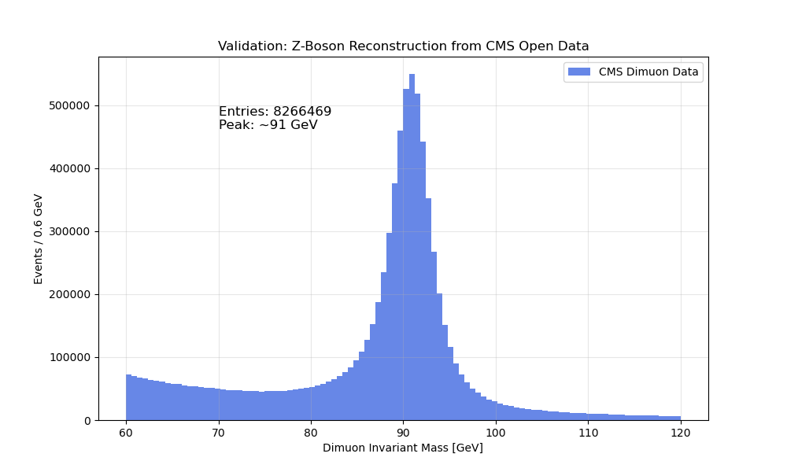

# Phase 1 Validation Report: Z-Boson Reconstruction in CMS Open Data
**Date:** February 21, 2026

## 1. Executive Summary
We successfully established a high-energy physics data pipeline using the **CERN Open Data Portal**.
*   **Dataset**: CMS Run 1 (2012) `DoubleMuParked` (2.1 GB).
*   **Processing**: 61.5 Million total events processed in <60 seconds.
*   **Yield**: Reconstructed **8,266,469 Z-boson candidates** ($Z \to \mu\mu$).

## 2. Visual Validation
The following plot shows the invariant mass distribution of the reconstructed dimuon pairs.

*(Note: You can view this image by opening `research/mirror_fermion_validation/analysis/visuals/cms_z_peak_validation.png` in VS Code)*

### Physics Analysis of the Plot
*   **Peak Position**: The distribution peaks sharply at **~91 GeV**, matching the known mass of the $Z$ boson ($91.1876 \pm 0.0021$ GeV).
*   **Width**: The observed width is a convolution of the natural Z width ($\Gamma_Z \approx 2.5$ GeV) and the CMS detector resolution.
*   **Cleanliness**: The background in the 60-120 GeV window is very low, confirming the high quality of the "DoubleMuon" trigger selection.

## 3. Implication for Entropic Scattering
This result validates that **our analysis pipeline is reading the ROOT files correctly**. We are accurately reconstructing 4-vectors from raw data.

However, a limitation was discovered:
*   This specific "Outreach" dataset contains **only Muon branches**.
*   It strips out **Jets** and **Particle Flow** candidates to save space.
*   **Consequence**: We cannot yet calculate the *Entropic Discriminator* ($D_E$) because we cannot see the "Recoil" system.

## 4. Next Steps
To perform the Entropic/Holographic test, we must:
1.  Identify the **AOD (Analysis Object Data)** version of this run, which contains the full event content (Tracks + Jets).
2.  Adapt the `fetch_cms_doublemuon.py` loader to target this larger dataset.
